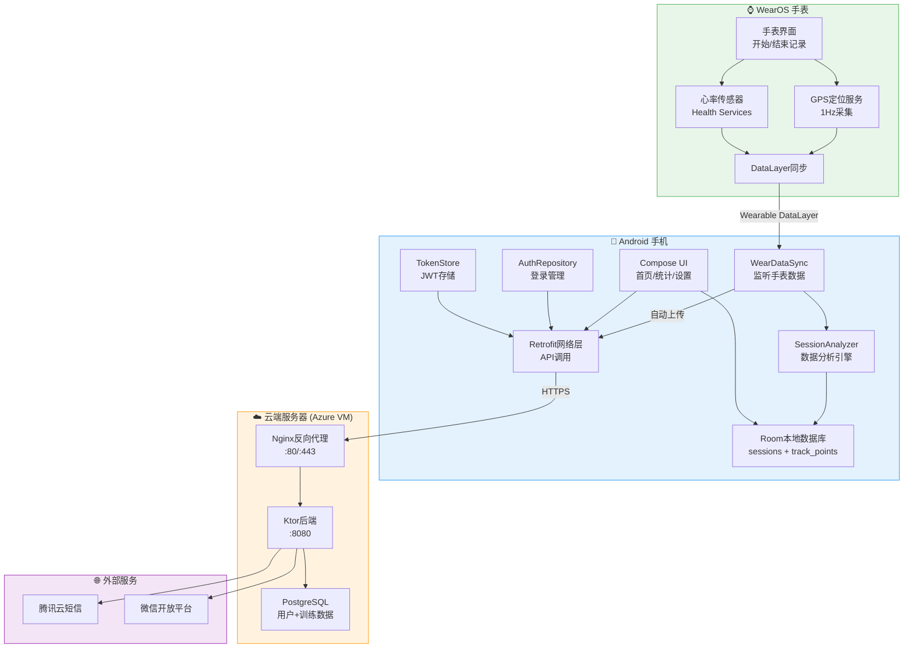
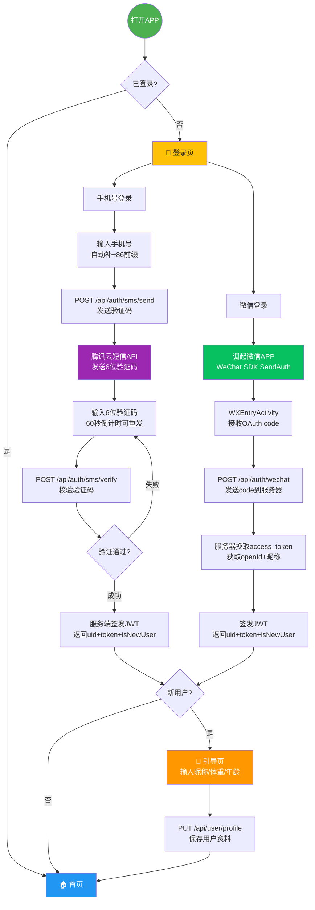
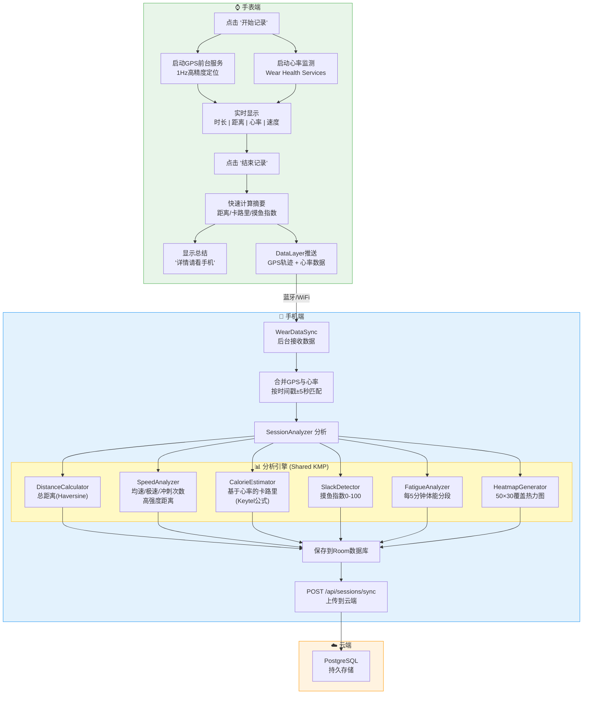
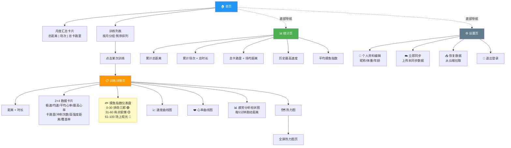

# Football Tracker 业务流程图

> 将下方每个 mermaid 代码块粘贴到 [mermaid.live](https://mermaid.live) 即可导出 PNG/SVG 图片。

---

## 1. 整体应用架构图 (System Architecture)



---

## 2. 用户登录与注册流程 (Auth Flow)



---

## 3. 核心业务流程：踢球记录全链路 (Session Recording Flow)



---

## 4. 数据查看与交互流程 (Data Viewing Flow)



---

## 5. 云端数据同步流程 (Cloud Sync Flow)

```mermaid
flowchart TD
    subgraph AUTO["自动同步 (手表数据到达时)"]
        A1["WearDataSync接收数据"] --> A2["保存到本地Room"]
        A2 --> A3{已登录?}
        A3 -->|是| A4["POST /api/sessions/sync<br/>上传训练记录"]
        A3 -->|否| A5["标记syncedToCloud=0<br/>等待登录后同步"]
        A4 --> A6["标记syncedToCloud=1"]
    end

    subgraph MANUAL_UP["手动同步 (设置页 - 立即同步)"]
        M1["点击'立即同步'"] --> M2["查询所有<br/>syncedToCloud=0的记录"]
        M2 --> M3{有未同步?}
        M3 -->|是| M4["POST /api/sessions/sync<br/>批量上传"]
        M3 -->|否| M5["提示'已全部同步'"]
        M4 --> M6["标记syncedToCloud=1"]
    end

    subgraph RESTORE["数据恢复 (设置页 - 恢复数据)"]
        R1["点击'恢复数据'"] --> R2["GET /api/sessions<br/>拉取云端所有记录"]
        R2 --> R3["对比本地数据库<br/>按session id去重"]
        R3 --> R4["插入缺失记录到Room"]
        R4 --> R5["数据恢复完成<br/>首页自动刷新"]
    end

    style AUTO fill:#E8F5E9,stroke:#4CAF50
    style MANUAL_UP fill:#E3F2FD,stroke:#2196F3
    style RESTORE fill:#FFF3E0,stroke:#FF9800
```



---

## 6. 页面导航地图 (Screen Navigation Map)

```mermaid
stateDiagram-v2
    [*] --> 判断登录状态

    判断登录状态 --> 登录页: 未登录
    判断登录状态 --> 首页: 已登录

    登录页 --> 手机验证码页: 手机号登录
    登录页 --> 微信授权: 微信登录

    手机验证码页 --> 引导页: 新用户
    手机验证码页 --> 首页: 老用户
    微信授权 --> 引导页: 新用户
    微信授权 --> 首页: 老用户

    引导页 --> 首页: 完成资料填写

    state 主界面 {
        首页 --> 训练详情: 点击训练记录
        训练详情 --> 热力图: 查看热力图
        热力图 --> 训练详情: 返回

        首页 --> 统计页: 底部导航
        统计页 --> 首页: 底部导航

        首页 --> 设置页: 底部导航
        设置页 --> 首页: 底部导航
        统计页 --> 设置页: 底部导航
    end

    设置页 --> 登录页: 退出登录
```

---

## 使用说明

1. 打开 [mermaid.live](https://mermaid.live)
2. 将上方任一 `mermaid` 代码块的内容粘贴到编辑器中
3. 右侧会自动渲染流程图
4. 点击右上角 **Actions → Download PNG/SVG** 导出图片
5. 将导出的图片提交即可

也可以使用 VS Code 的 **Markdown Preview Mermaid Support** 插件直接在 IDE 中预览。
